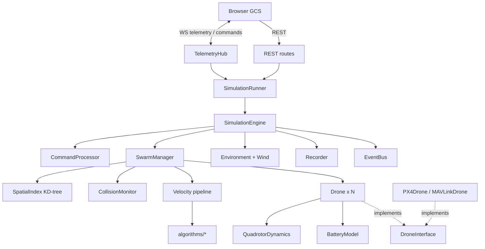

# Drone Swarm Simulation Platform — Architecture & Design

This document is the design baseline for the platform. It covers the system
architecture, component boundaries, data flow, technology decisions, the
mathematical models used by the simulation, the external API, the
configuration system and the phased development plan.

---

## 1. System architecture

The platform is organised in strictly layered modules. Dependencies only point
*downwards*; nothing in the simulation core knows that a web server or a
browser exists.

| Layer | Package | Responsibility |
|---|---|---|
| Presentation | `frontend/` | Browser Ground Control Station (Three.js 3D view, fleet panels, operator controls) |
| Integration | `backend/`, `integration/` (P6) | FastAPI REST + WebSocket telemetry, MAVLink / PX4 adapters |
| Runtime | `simulation/engine.py`, `simulation/runner.py` | Deterministic stepper, real-time scheduler thread, command queue, snapshot publication, recording |
| Mission | `missions/` (P5) | Mission state machines that command drones through the same interface the operator uses |
| Algorithms | `algorithms/` (P2–P5) | Formation, flocking, collision avoidance, task allocation, path planning, target tracking |
| Estimation | `estimation/` (P4) | Kalman filter (replaceable by EKF/UKF) |
| Simulation core | `simulation/` | Drones, dynamics, battery, environment, wind, spatial index, sensors (P4), comms (P4) |

Design rules:

1. **The engine is single-threaded and deterministic.** Given the same
   configuration, seed and command sequence, a run is bit-for-bit reproducible.
   This is what makes algorithm comparisons and regression tests meaningful.
2. **All cross-thread interaction goes through the runner.** Commands are
   queued and applied at tick boundaries; readers only ever see immutable
   snapshots.
3. **Drones are only commanded through `DroneInterface`.** The operator, the
   mission manager and the swarm algorithms use the same verbs (`takeoff`,
   `goto`, `set_velocity`, …). Replacing `SimulatedDrone` by `PX4Drone` does
   not change any caller.
4. **Swarm behaviour is never hard-coded into the drone.** A drone knows how to
   fly to a setpoint and how to protect itself (failsafes). Formation,
   flocking and avoidance are *velocity pipeline stages* owned by the swarm
   layer.
5. **Every tunable lives in configuration**, validated at load time.

---

## 2. Component diagram

```text
                               ┌────────────────────────────────────┐
                               │     Browser GCS (Three.js)         │
                               │  3D view · fleet · inspector · log │
                               └──────────────┬─────────────────────┘
                                   WebSocket  │  REST
                               ┌──────────────┴─────────────────────┐
                               │ backend (FastAPI)                  │
                               │  api/routes  websocket/hub         │
                               │  telemetry/messages                │
                               └──────────────┬─────────────────────┘
                       submit(cmd) → Future   │  latest_snapshot()
                               ┌──────────────┴─────────────────────┐
                               │ SimulationRunner (thread)          │
                               │  fixed-rate loop · command queue   │
                               └──────────────┬─────────────────────┘
                               ┌──────────────┴─────────────────────┐
                               │ SimulationEngine                   │
                               │  CommandProcessor · EventBus       │
                               │  SimulationRecorder (CSV / JSON)   │
                               └───┬───────────────┬────────────┬───┘
                                   │               │            │
                    ┌──────────────┴───┐  ┌────────┴───────┐ ┌──┴──────────────┐
                    │ SwarmManager     │  │ Environment    │ │ MissionManager  │
                    │  registry        │  │  bounds/terrain│ │  (Phase 5)      │
                    │  SpatialIndex    │  │  WindModel     │ └─────────────────┘
                    │  CollisionMonitor│  │  Obstacles(P3) │
                    │  velocity        │  └────────────────┘
                    │  pipeline ◄──────┼── algorithms/ (formation, flocking,
                    └────────┬─────────┘    avoidance, allocation, tracking)
                             │ 1..N
                    ┌────────┴─────────┐
                    │ Drone            │ implements DroneInterface
                    │  mode FSM        │
                    │  guidance        │──► QuadrotorDynamics + VelocityController
                    │  failsafes       │──► BatteryModel
                    │  telemetry       │──► Sensors / KalmanFilter / CommLink (P4)
                    └──────────────────┘

         Integration (Phase 6):  DroneInterface ◄── PX4Drone (MAVSDK) / MAVLinkDrone (pymavlink)
```



---

## 3. Data flow

### 3.1 Simulation tick (default 30 Hz, physics sub-stepped)

```text
 ┌─ runner: drain command queue ─► CommandProcessor ─► Drone.goto()/takeoff()/…
 │
 │  engine.step():
 │   1. environment.step(dt)            wind gusts, dynamic obstacles (P3)
 │   2. perception                      KD-tree rebuild → neighbour lists,
 │                                      collision states, (P4: sensors, comms)
 │   3. guidance                        each drone's mode FSM → desired velocity
 │   4. velocity pipeline               lowest → highest priority stage:
 │                                        mission → formation → obstacle avoid
 │                                        → collision avoid   (P2/P3)
 │   5. control + physics (k substeps)  PI velocity loop → thrust lag → rigid body
 │                                      → ground contact → battery drain
 │   6. post-step                       failsafes (battery, offboard timeout),
 │                                      events
 │   7. recorder                        telemetry.csv at record rate, events JSON
 │
 └─ runner: publish snapshot at telemetry rate ─► TelemetryHub ─► WebSocket clients
```

Stage ordering implements the required priority
`Collision Avoidance > Obstacle Avoidance > Formation Control > Mission Navigation`:
each stage receives the velocity proposed by lower-priority stages and may
modify it, so the highest-priority stage has the final word.

### 3.2 Command path

```text
UI click ─► WS {"type":"command","id":7,"command":{...}}
        ─► TelemetryHub ─► runner.submit(cmd) ─► queue ─► (engine thread) CommandProcessor
        ─► CommandResult ─► Future ─► WS {"type":"command_result","id":7,...}
```

### 3.3 Telemetry path

Snapshots are plain `dict`s built in the engine thread, handed to the runner
under a lock, encoded **once** per snapshot by the hub, and pushed to every
client through a size-1 "latest wins" queue. A slow client drops frames
instead of building up latency or slowing the simulation.

---

## 4. Directory structure

```text
drone_swarm_sim/
├── backend/                     FastAPI application (P1)
│   ├── main.py                  app factory, lifespan, access-control middleware, static frontend, serve()
│   ├── security.py              (Stage 5) PBKDF2 users, signed tokens, roles, AuditLog
│   ├── api/routes.py            REST endpoints
│   ├── api/auth.py              (Stage 5) login / logout / me / audit
│   ├── api/replay.py            (Stage 5) recorded runs, frame windows, reports
│   ├── websocket/hub.py         telemetry broadcaster + command channel
│   ├── websocket/routes.py      /ws/telemetry endpoint
│   └── telemetry/messages.py    wire message schema + JSON encoding
├── simulation/                  simulation core (P1, extended P3/P4)
│   ├── __main__.py              `python -m simulation`
│   ├── config.py                typed configuration + YAML loader
│   ├── types.py                 enums shared by all layers
│   ├── geo.py                   WGS84 ⇄ ECEF ⇄ ENU
│   ├── dynamics.py              quadrotor point-mass model + velocity controller
│   ├── guidance.py              position → velocity guidance laws
│   ├── battery.py               energy-based battery model
│   ├── drone_interface.py       DroneInterface ABC, telemetry schema
│   ├── drone.py                 SimulatedDrone (mode FSM, failsafes)
│   ├── environment.py           world bounds, terrain hook, wind model
│   ├── spatial.py               KD-tree spatial index, collision monitor
│   ├── swarm.py                 SwarmManager + velocity pipeline
│   ├── events.py                event bus
│   ├── alerts.py                operator alerts from events (priorities, dedup, ack)
│   ├── terrain.py               height field (procedural / .asc / .png / .npy / .csv)
│   ├── obstacles.py             YAML scenes, signed distances, KD-tree queries
│   ├── communication.py         GCS link model, failsafe, command delivery, delayed telemetry
│   ├── sensors.py               GPS / baro / compass / IMU models
│   ├── failures.py              instructor failure injection
│   ├── commands.py              operator command processor
│   ├── engine.py                deterministic simulation engine
│   ├── runner.py                real-time thread runner
│   ├── recorder.py              telemetry.csv / *_events.json (streamed) / world.json
│   ├── replay.py                (Stage 5) RunLog parser, frame windows, ReplayStore LRU
│   ├── report.py                (Stage 5) post-mission report: vector charts → SVG / HTML and a built-in PDF writer
│   ├── logging_setup.py         simulation.log configuration
│   ├── benchmark.py             stress/benchmark tool
│   ├── sensors.py               (P4) GPS, IMU, baro, compass, range
│   └── communication.py         (P4) packet loss, latency, range
├── algorithms/                  (P2–P5)
│   ├── formation.py             shapes, altitude layers, Hungarian assignment, CAPT transitions, leader promotion
│   ├── orca.py                  ORCA half-spaces + RVO2-3D linear program
│   ├── collision_avoidance.py   ORCA → potential-field fallback → hard safety filter (priority 40)
│   ├── flocking.py              Reynolds flocking (priority 20)
│   └── coordinator.py           swarm modes and their commands
├── estimation/                  (Stage 4) kalman_filter.py (batched KF), navigation.py (sensor fusion)
├── algorithms/obstacle_avoidance.py, algorithms/path_planning.py   (Stage 4)
├── configs/scenes/demo.yaml     example obstacle scene
├── missions/                    (Stage 2)
│   ├── model.py                 mission / waypoint schema (gandiv.mission/1)
│   ├── manager.py               MissionManager: runs, groups, geofence, mission commands
│   ├── survey.py                lawnmower coverage + cell decomposition + N-drone split
│   ├── geofence.py              inclusion / no-fly / ceiling, predictive breach monitor
│   ├── validation.py            pre-flight checks + battery-model energy estimate
│   ├── qgc.py                   QGC WPL 110 export / import
│   ├── storage.py               mission_*.json library
│   └── geometry.py              polygon helpers
├── integration/                 (Stage 5) hardware adapters
│   ├── remote.py                RemoteState, RemoteLink (thread base), RemoteDrone(Drone)
│   ├── mavlink_drone.py         MAVLinkLink (pymavlink): procedures, setpoints, telemetry
│   └── mavsdk_drone.py          MAVSDKLink (native mavsdk>=4): callbacks + worker thread
├── scripts/sitl_swarm.py        (Stage 5) N ArduPilot SITL + simulated drones, PASS/FAIL
├── frontend/                    browser GCS (no build step)
│   ├── index.html
│   ├── src/*.js                 ES modules: main, net, scene, drones, ui, state, coords,
│   │                            plan (PLAN tab), overlays (3D fence / paths / measure),
│   │                            hud, charts, alerts, minimap, world, auth, replay (Stage 5)
│   ├── styles/main.css
│   └── vendor/three/            vendored Three.js (works offline)
├── configs/simulation.yaml
├── docs/ARCHITECTURE.md
├── tests/
├── logs/                        simulation.log + one folder per run
├── requirements.txt · pyproject.toml · README.md
└── Dockerfile · docker-compose.yml   (P6)
```

---

## 5. Technology decisions

| Concern | Decision | Rationale | Rejected / deferred |
|---|---|---|---|
| Physics | Custom NumPy point-mass quadrotor with attitude-limited thrust, first-order thrust lag, aerodynamic drag, wind | Deterministic, fast enough for 100+ drones in real time, captures the dynamics that matter for *swarm* algorithms (accel/tilt limits, overshoot, wind drift). Rotor-level fidelity is delegated to PX4 SITL + Gazebo later. | PyBullet: heavy, non-deterministic across platforms, little benefit at swarm level |
| 3D visualisation | Three.js in the browser | Fully decoupled from the engine, remote-capable, one UI for view + control | Open3D (desktop only, couples UI to process) |
| Neighbour search | `scipy.spatial.cKDTree`, rebuilt each tick | O(N log N) build, O(log N) queries; rebuild of 100 points costs ≈ 50 µs | Uniform grid (kept as a later option for >1000 agents) |
| Concurrency | Engine in a dedicated thread, asyncio for I/O | Keeps the physics timestep independent of network load | multiprocessing (serialisation overhead, not needed at this scale) |
| Transport | JSON over WebSocket, 20 Hz, latest-wins | Human-readable, trivially consumable; ~30 kB/frame for 50 drones | MessagePack (drop-in later if bandwidth matters) |
| Frontend tooling | Native ES modules + import map, Three.js vendored | Zero build step, runs offline, easy to read; can migrate to TypeScript/Vite later without changing the protocol | Webpack/Vite toolchain in P1 |
| Configuration | YAML → typed dataclasses, strict unknown-key detection, `--set a.b=c` overrides | Typos fail loudly; defaults documented in code | pydantic-settings (extra dependency for no gain) |
| Frames | Local ENU (x=East, y=North, z=Up), WGS84 for global; heading shown as compass degrees | ENU is the ROS REP-103 convention; PX4 uses NED, conversion lives in the PX4 adapter | — |
| Language | Python ≥ 3.11, type hints, dataclasses, ABCs | Required by the specification; 3.11+ gives fast `time.sleep` on Windows and `StrEnum` | — |

---

## 6. Mathematical models

### 6.1 Coordinate frames

**Geodetic → ECEF** (WGS84, `a = 6378137 m`, `f = 1/298.257223563`, `e² = f(2−f)`):

```text
N(φ) = a / sqrt(1 − e² sin²φ)
X = (N + h) cosφ cosλ
Y = (N + h) cosφ sinλ
Z = (N(1 − e²) + h) sinφ
```

**ECEF → ENU** relative to origin `(φ₀, λ₀, h₀)`:

```text
          ┌ −sinλ₀          cosλ₀          0    ┐
[e n u]ᵀ = │ −sinφ₀cosλ₀   −sinφ₀sinλ₀    cosφ₀ │ · (P_ecef − P₀_ecef)
          └  cosφ₀cosλ₀    cosφ₀sinλ₀    sinφ₀ ┘
```

The inverse uses `Rᵀ` followed by Bowring's closed-form ECEF → geodetic
conversion (sub-millimetre error near the Earth's surface).

**Heading:** internally `ψ` is the ENU yaw (counter-clockwise from East,
radians). Operators see compass heading `H = (90° − ψ) mod 360°`.

### 6.2 Vehicle dynamics

Each drone is a point mass with an attitude-limited, lagged thrust vector.

```text
f_des = a_des + g·ẑ                                 desired specific thrust
f_des ← limit_tilt(f_des, θ_max), |f_des| ≤ (T/W)·g  physical envelope
f    ← f + (f_des − f)(1 − e^(−Δt/τ))               motor/attitude response (1st order)
a    = f − g·ẑ − c_d (v − w)                         drag relative to air (wind w)
v    ← v + aΔt,  p ← p + vΔt                         semi-implicit Euler
```

Attitude is derived from the thrust direction expressed in the heading frame:
`pitch = −atan2(f_fwd, f_z)`, `roll = atan2(f_right, sqrt(f_fwd² + f_z²))`.
Yaw follows a rate-limited proportional law `ψ̇ = clip(k_ψ·wrap(ψ_sp − ψ), ±ψ̇_max)`.
Ground contact is a unilateral constraint; touchdown speed is recorded to
detect hard landings.

### 6.3 Control

*Inner loop (velocity, PI with drag feed-forward and conditional-integration anti-windup):*

```text
e = v_sp − v
a_des = K_p e + K_i ∫e dt + c_d v_sp
|a_des,xy| ≤ min(a_max, g tanθ_max),   |a_des,z| ≤ a_max
```

The integral term rejects steady wind; the feed-forward cancels still-air drag.

*Outer loop (position guidance with a braking profile):*

```text
d = p_target − p
speed = min(v_cruise, K_pos·|d|, sqrt(2·a_brake·|d|))
v_sp  = speed · d/|d|        then scaled uniformly to respect climb/descent limits
```

The `sqrt(2·a·d)` term is the minimum-time braking curve, so drones decelerate
smoothly and arrive without overshoot; scaling the whole vector keeps the path
a straight line.

### 6.4 Battery

Energy model (`E` in Wh, power in W):

```text
P = P_avionics                                        disarmed
P = P_avionics + P_idle                               armed on ground
P = P_avionics + P_hover·(m_tot/m)^1.5                momentum theory: P ∝ T^1.5
      + k_v·|v − w|²                                   parasitic/translational
      + m_tot·g·max(v_z,0)/η_climb                     potential energy rate
      + k_a·m_tot·|a|                                  manoeuvring
E ← E − P·Δt/3600 · drain_multiplier
V = n_cells·(V_empty + (V_full − V_empty)·SoC) − I·R_pack,   I = P / V_oc
```

Wind enters through the air-relative speed `|v − w|` — hovering in a headwind
costs energy. Thresholds (30 / 20 / 10 %) map to `WARNING`, `RETURN_HOME` and
`EMERGENCY` states that trigger failsafes.

### 6.5 Wind

```text
w(z, t) = s(z)·w̄ + g(t)
w̄ = −V·[sin D, cos D, 0]              D = meteorological direction (wind comes FROM D)
s(z) = clip((z/10 m)^(1/7), 0.3, 1.6)  power-law shear
dg = −g/T·dt + σ·sqrt(2dt/T)·N(0,1)    Ornstein-Uhlenbeck gusts, T = 1/gust_frequency
```

The OU process is the continuous-time equivalent of a first-order Dryden
filter: stationary with std `σ` (gust strength) and correlation time `T`.

### 6.6 Neighbours and collision detection

Positions are indexed in a KD-tree every tick. Neighbours:
`tree.query(p, k = k_max+1, distance_upper_bound = r_neigh)`. Conflicts:
`tree.query_pairs(r_warning)`. Only airborne drones take part in collision
detection. For each pair with distance `d`:

```text
d < collision_distance  → COLLISION
d < separation_distance → AVOIDANCE
d < warning_distance    → WARNING
```

Escalations are recorded in `collision_events.json`.

### 6.7 Swarm algorithms (Phase 2)

* **Formation slots.** Each shape generator returns body-frame offsets
  `oᵢ ∈ ℝ³` (line, column, V, diamond, grid, circle, wedge, custom — the custom
  shape comes from `swarm.custom_formation` or from `offsets` in `set_formation`).
  With `L` altitude layers, slot `k` is lifted by `((k mod L) − (L−1)/2)·Δz`.
  World slots are `sᵢ = p_ref + R(ψ_ref)·oᵢ`; `ψ_ref` follows the direction of
  travel unless a heading is fixed (`swarm.formation_heading` or `heading`).
* **Slot assignment.** Hungarian algorithm (`scipy.optimize.linear_sum_assignment`)
  minimising `Σ |pᵢ − s_σ(i)|²`. For the squared cost the optimal straight-line
  paths never cross.
* **Synchronized transitions (CAPT).** On every shape or membership change, each
  drone's slot target moves from where the drone is (`aᵢ`, body frame) to its new
  slot (`bᵢ`) with one shared profile:
  `oᵢ(t) = aᵢ + (bᵢ − aᵢ)·s(t/T)`, `s(x) = 3x² − 2x³`.
  `T = 1.5 · max(|Δxy|/v_catch, Δz↑/v_climb, Δz↓/v_desc) / 0.8` (smoothstep peaks
  at 1.5× the mean speed). All drones start and finish together; with the
  squared-distance assignment, synchronized straight lines keep the start/goal
  separation (Turpin, Michael & Kumar 2014), so transitions are collision-free
  by construction. The tracking law is
  `vᵢ = v_ref + R(ψ)·ȯᵢ + approach(pᵢ → sᵢ)`.
* **Leader–follower.** `v_i = v_leader + K(s_i − p_i)` (feed-forward of the
  leader velocity plus slot tracking). The leader counts as lost when it fails, its
  link is `LOST`, it lands, or it enters RTL/EMERGENCY. The follower on the slot
  closest to the lead position is then **promoted**: it inherits the old leader's
  goto target (or hovers) and the others re-slot behind it. A `leader_promoted`
  event is logged. With `swarm.leader_promotion: false`, the formation holds on a
  virtual reference instead.
* **Reynolds flocking.**
  `sep = Σ_j (1 − d/r_sep)(p_i−p_j)/d · v_max`,
  `ali = mean(v_j)`,
  `coh = k_coh(mean(p_j) − p_i)`,
  `V = W₁sep + W₂ali + W₃coh + W₄goal + W₅obs`, with every weight tunable at
  runtime (`set_flocking_weights`, GCS sliders).
* **Collision avoidance** (velocity stage, priority 40) has three layers:
  1. **ORCA** (primary). For agent `i` and each of its `K` closest neighbours,
     with `p = p_j − p_i`, `v = v_i − v_j`: the velocity obstacle
     `VO = {v | ∃t∈[0,τ]: |t·v − p| < R}` is a cone truncated by a sphere of radius
     `R/τ` centred at `p/τ`. `u` is the smallest change of relative velocity that
     leaves the VO and `n` is the outward normal. The half-space is
     `ORCA_i|j = {v | (v − (v_i + ½u))·n ≥ 0}`; agent `i` takes the full `u` if `j`
     cannot manoeuvre. The new velocity is the point nearest the preferred
     velocity inside every half-space and the speed sphere. It is found with the
     RVO2-3D incremental linear program (`linear_program3`), which runs only for
     agents whose preferred velocity violates a constraint.
     `R = separation_distance + avoidance_margin`.
  2. **Potential field** (fallback when a drone's ORCA program is infeasible, or
     selected with `avoidance_method: potential_field`):
     `|v_rep| = v_max((d₀ − d)/(d₀ − d_col))²` along `n_ij`. It is combined with a
     closest-point-of-approach push (`t* = −(Δp·Δv)/|Δv|²`), a keep-right rule for
     exact head-on courses, and yielding.
  3. **Hard safety filter** (a discrete control-barrier function on the braking
     distance), always last:
     `h = d − d_min − c_act·(τ_lag + Δt) − 0.3 m`,
     closing speed `c = −(v_i − v_j)·n_ij ≤ √(2·a_rel·h)` for `h > 0`, or
     `≤ h/1 s` (forced separation) otherwise. Here `a_rel` is the braking both
     drones contribute (`safety_brake_fraction` × horizontal accel limit each) and
     `τ_lag = τ_thrust + 1/K_p` is the velocity-loop lag. Excess closing speed is
     removed along `n_ij` in four Gauss-Seidel sweeps. Because the constraint is
     on the braking distance, **`d ≥ swarm.min_separation` holds even when ORCA's
     instant-velocity assumption fails**. Tests ram drones together at 15 m/s
     each and implode a 16-drone swarm onto its centroid with ORCA and the
     potential field switched off, and the floor still holds.
     Disabling avoidance (`set_avoidance {enabled:false}`) is an explicit
     operator override that switches off all three layers.

### 6.7a Formation reference dynamics

The virtual reference behaves like a vehicle, so every slot moves in a way the drones can follow:

```text
v_ref ← clip(min(v_form·keep·align, √(2·a_ref·d)), v_ref − 2a_ref·Δt, v_ref + a_ref·Δt)   a_ref = 0.35·a_max,h
ω_max = min(30°/s, 0.6·v_catch / r_max)      α = a_ref / r_max       (r_max = outermost slot radius)
ω     ← clip(sign(e)·min(ω_max, √(2α|e|)), ω − αΔt, ω + αΔt)         e = heading error
align = clip((cos e − 0.5)/0.5, 0, 1)        turn in place first, translate once within 60°
v_slot = v_ref + R(ψ)·ȯᵢ + ω ẑ × (sᵢ − p_ref)                        rotation feed-forward
```

On a 12-drone mission this cut the peak slot error at leg changes from 33 m to 3.6 m.

### 6.8 Missions, survey and geofence (Stage 2)

* **Mission model** (`missions/model.py`): one or more *tracks* of waypoints
  `{x, y, alt, speed?, hold, action, params}`. Actions are WAYPOINT, LOITER (`radius`),
  TAKEOFF, LAND, RTL and CHANGE_FORMATION (`shape`, `spacing?`). The JSON schema
  `gandiv.mission/1` is enforced strictly on every path in (unknown keys, ranges, required
  params) and files are saved as `mission_<slug>.json`.
* **Execution** (`missions/manager.py`). A *formation track* moves the formation reference
  (or the leader) from waypoint to waypoint. It arrives when the reference has stopped within
  1 m of the target and every slot error is below `formation_arrival_error`. A *single track*
  gives one drone its own goto sequence. LOITER orbits at `radius` with a look-ahead point on the
  circle. Takeoff is inserted automatically when drones start on the ground. Executors use only
  `DroneInterface` and the coordinator. Operator commands, failsafes and geofence actions release
  the drones they touch. Multi-track missions are assigned drone ↔ track with the Hungarian
  algorithm on the distance to each track's first waypoint.
* **Survey** (`missions/survey.py`): `spacing = 2h·tan(hfov/2)·(1 − overlap)`. The polygon is
  rotated so the sweep direction is +x (default: along the longest edge). Sweep lines are cut
  by even-odd pairing of edge crossings. A simplified boustrophedon decomposition then covers each
  cell (a run of lines with the same segment count, one segment index) completely before the next,
  entering it greedily at the nearest end, so a U-shaped area is crossed once rather than on every
  line. Passes are split into N contiguous blocks of about equal length, one strip per drone.
* **Geofence** (`missions/geofence.py`): an inclusion polygon, exclusion (no-fly) polygons and an
  optional ceiling. The check is predictive: `p` and `p + v·t_look` are both tested, so HOLD
  stops a drone before it enters a zone. The action (RTL | LAND | HOLD) is applied once per breach
  episode and logged as CRITICAL.
* **Pre-flight validation** (`missions/validation.py`): waypoints outside the world, fence or
  ceiling, legs crossing no-fly zones, unreachable altitudes, speeds over the airframe limit, and
  **battery**. Each leg costs `P(v_air = v + w_wind, v_climb)·t`, where `P` is the battery power model
  (§6.4), `t = max(d_h/v + v/a, d_z/v_z)`, and holds or loiters hover. A mission that does not end on
  the ground also budgets the return home and landing. The total must fit in each drone's
  `E − reserve%·capacity`. Estimates came within 25 % of simulated energy and 30 % of flight time
  in tests. Warnings need an explicit `force: true` (a GCS confirmation dialog) to upload.
* **QGC WPL 110** (`missions/qgc.py`): home on line 0 (frame 0, AMSL). Items use frame 3
  (relative altitude; frame 10 in AGL mode): 16 WAYPOINT, 19 LOITER_TIME, 22 TAKEOFF, 21 LAND,
  20 RTL, 178 DO_CHANGE_SPEED before a speed change, and 31010 (MAV_CMD_USER_1) for
  CHANGE_FORMATION. Import maps them back and reports unsupported commands as warnings.

### 6.8a Operator awareness (Stage 3)

* **Predicted flight time** per drone: `t_left = 3600·(E − E_cap·emergency%)/P̄`. Here `P̄` is the
  power drawn in flight, smoothed with an exponential average (τ = 5 s), so wind, speed and climb are
  included; on the ground hover power is used. The swarm figure is the minimum over airborne drones
  (when the first drone must stop).
* **Link quality** (until the Stage 4 communication model owns it): `q = 100·clip(1 − (r/R)², 0, 1)`
  with `r` the range to the GCS at the home base and `R = communication.range`.
* **Minimum separation**: nearest airborne neighbour from a KD-tree over the airborne drones
  (`cKDTree.query(k=2)`), every tick. It is not limited to the warning radius the collision monitor uses.
* **Alerts** (`simulation/alerts.py`): every bus event is classified. CRITICAL events become CRITICAL
  alerts that need acknowledgement; WARNING events become WARNING alerts that expire after
  `warning_ttl_s`; mission started / completed / aborted become INFO alerts. Command results are never
  alerts. A repeat with the same kind and drones within `dedup_window_s` increments `count`. The
  active list is bounded (`max_active`), dropping acknowledged or non-critical alerts first, and a
  bounded history (`max_alerts`) feeds reports. Acknowledgement is the `ack_alert` command.

### 6.8b Realism (Stage 4)

* **Terrain** (`simulation/terrain.py`): a height grid stretched over the world bounds,
  `h(x, y) = offset + scale · bilinear(grid)`, with the edge value outside. Sources are procedural
  (seeded sum of Gaussian hills, flattened with a smoothstep rim around home) or a heightmap file:
  ESRI ASCII `.asc` (NODATA → minimum), 8/16-bit grayscale PNG (built-in decoder, all five filter
  types, standard library only), `.npy` or `.csv`. `Environment.ground_height` uses it everywhere
  (pads, AGL, clamping, landing, wind shear). Terrain and wind are evaluated once per tick, vectorised.
  Missions with `altitude_mode: agl` place waypoints above the terrain under them, and legs are
  densified every 25 m to follow the ground.
* **Obstacles** (`simulation/obstacles.py`): buildings are oriented boxes; towers and trees are
  cylinders; forests are seeded tree scatters. Signed distance of an extruded footprint:
  `sdf = hypot(max(d_h,0), max(d_v,0)) + min(max(d_h, d_v), 0)` with `d_v = z − top`, together with the
  outward normal. Candidates come from the platform KD-tree (`SpatialIndex.query_ball`) over obstacle
  centres, within `influence + max bounding radius`. A drone within `radius + collision_margin` of a
  surface crashes (it fails and falls), which is logged as a CRITICAL `obstacle_collision`.
* **Obstacle / terrain avoidance** (`algorithms/obstacle_avoidance.py`, priority 30) applies the same
  braking-distance barrier as §6.7 to the nearest obstacle surface:
  `c = −v·n ≤ √(2 a_b (d − clearance − c_act τ_lag))`, plus a tangential slide that keeps the drone
  moving along the surface. It applies the barrier to height above the highest terrain under the drone
  now and one second ahead, which limits both sinking and flying into rising ground (landing,
  take-off and emergency descents are exempt).
* **Path planning** (`algorithms/path_planning.py`): the straight segment is tested first. **A\*** runs
  on a 2-D grid at `max(z_start, z_goal)`: a cell is blocked by obstacles whose top reaches
  `altitude − clearance` within `clearance + radius`, and by terrain above `altitude − terrain_clearance`.
  It is 8-connected, with no corner cutting and the octile heuristic, coarsened to at most
  `max_grid_cells`. **RRT\*** samples 3-D with 10 % goal bias, near radius
  `min(γ(log n/n)^{1/3}, 2.5·step)`, best-parent choice and rewiring. Both finish with greedy
  line-of-sight shortcutting. Routes feed `Drone.goto_path` (pass-through waypoints, switched at
  `max(3·acceptance, 0.8·v)`), the formation reference (the clearance grows by the formation radius when
  the whole shape fits), and mission legs.
* **Communication** (`simulation/communication.py`): per drone and per heartbeat, one packet each way
  with success probability `p = (1 − p_loss)·e(r)`, where `e = 1` below `edge_fraction·R` and falls
  linearly to 0 at `R`. Delivery comes after `latency + jitter·N(0,1)` through a time-ordered queue.
  Link quality is the success ratio of the last 20 packets. With no uplink heartbeat for `timeout_s`
  the link is **LOST**; after `failsafe_timeout_s` in LOST the drone runs RTL, LAND or HOLD once.
  Downlink packets carry telemetry captured when sent, so the GCS view is one latency old and freezes
  while the link is down. Operator commands travel the uplink: they are rejected when the GCS has
  lost the drone, otherwise retried every `retry_interval_s` up to `command_retries` times, and they
  are acknowledged with a `command_ack` event.
* **Sensors** (`simulation/sensors.py`): GPS `z = p + b + n` with a Gauss-Markov bias
  `b ← b e^{−Δt/T} + σ_b √(1 − e^{−2Δt/T}) N(0,1)`; the barometer has its own Gauss-Markov bias; the
  compass has a constant bias plus noise; the gyro and accelerometer add noise. A GPS loss reports
  fix NONE, 0 satellites and HDOP 99.9.
* **Navigation** (`estimation/navigation.py`): the §6.10 Kalman filter, batched over all drones and
  axes, is predicted with the accelerometer and corrected with GPS (x, y, z) and the barometer (z).
  Heading uses a complementary filter, `ψ ← ψ + r Δt + k·wrap(ψ_compass − ψ)`. With
  `control_source: estimate` the autopilot guidance uses the estimate, so GPS drift and GPS loss move
  the real drone. Collision and obstacle avoidance keep the true geometry, standing in for onboard
  relative sensing, so the Stage 1 separation guarantee is unaffected.
* **Failure injection** (`simulation/failures.py`, instructor mode): *motor* (partial thrust with an
  emergency descent, or total, a crash), *gps_loss*, *comm_loss*, *battery_sag* (capacity drop) and
  *wind_gust* (per-drone local wind). Failures can be timed or held until cleared, and injections and
  clears are logged (CRITICAL or WARNING, so they raise alerts).

### 6.8c Operations (Stage 5)

* **Recording without memory growth** (`simulation/recorder.py`): telemetry rows go straight to the CSV
  (flushed every second). Events are batched for at most 2 s (wall clock), then appended to
  `mission_events.json` / `collision_events.json`. These are JSON arrays grown one element per line and
  closed with `]` when the run ends. `read_json_array` also reads an unterminated file, dropping a
  partially written last line. The only state kept is the pending batch, so memory is flat however
  long the run. `world.json` (world description, final geofence, drone names and sources) is written at
  the start and the end of a run. New CSV columns: `name, source, altitude_agl, battery_state,
  nearest_distance, airborne`. Older recordings still parse with defaults.
* **Replay** (`simulation/replay.py`): a `RunLog` parses `telemetry.csv` once into columns:
  * float32 numbers, plus float64 lat/lon (float32 would lose about 0.4 m)
  * int16 codes into per-column vocabularies for the text fields
  * int8 flags

  Rows are sorted by `(t, id)`; `np.unique` gives the frame start indices, and `searchsorted` finds a
  time window. `frames(t0, t1)` returns rows `[id, *numeric, *codes, *flags]` (about 30 values per
  drone per frame), and the column layout and vocabularies travel once in the run meta. A 50-drone,
  30-minute run is about 450 k rows and about 35 MB parsed. `ReplayStore` keeps `replay.cache_runs`
  runs (LRU) and re-parses a run still being recorded at most every 15 s. The browser keeps the current
  and next `chunk_s` windows, turns a frame into a telemetry-shaped snapshot (`replay: true`), and hands
  it to `Dashboard.onTelemetry` at up to 20 Hz. The minimum separation and the event-log tail are
  recomputed client-side. Event markers are warnings, criticals, commands and mission events; beyond
  `replay.max_events`, every critical is kept and the rest are evenly thinned.
* **Report** (`simulation/report.py`): `build_report_data` gathers:
  * per-drone stats: distance (sum of ‖Δp‖), max AGL, battery start → end, airborne time, final mode
  * the per-frame minimum separation of airborne drones (a KD-tree 2-NN per frame)
  * collisions and violations; alerts, using the same rule as `alerts.classify`
  * commands (excluding the link model's per-drone acks) with their issuing users
  * a thinned timeline

  The charts are `Drawing` primitives (polyline, text, rect, circle; top-left points). `to_svg` renders
  them for HTML; `PdfDocument` renders the same primitives as PDF operators (y flipped, circles as four
  Béziers). `PdfDocument` is a flowing A4 layout with headings kept with their block, tables that repeat
  their header on page breaks, Helvetica / WinAnsi text with approximate advance widths for alignment
  and clipping, Flate-compressed content streams, and an xref table. An 8-bit grey/RGB PNG logo embeds
  as-is (Flate + PNG predictor 15). Other logos fall back to the wordmark in the PDF but still show in
  the HTML as a data URI.
* **Hardware adapters** (`integration/`): `RemoteDrone` subclasses `Drone`, so the pipeline, missions,
  alerts and GCS are unchanged.
  * `post_step` converts the link's `RemoteState` (geodetic + NED) to ENU with the engine's
    `GeoReference`. Yaw is `ψ_ENU = atan2(cos ψ_NED, sin ψ_NED)`.
  * It maps autopilot modes: LAND / RTL follow the autopilot; GUIDED keeps the GCS-side mode with
    arrival and route sequencing done here; any other mode shows as HOVER with the mode name as the task.
  * `integrate` streams the pipeline velocity as NED setpoints at `hardware.setpoint_rate_hz` in
    FORMATION / OFFBOARD.
  * Links own a thread; the engine thread only reads snapshots and queues commands, so it never blocks.
  * `MAVLinkLink` runs multi-step procedures (GUIDED → arm with retries until the EKF has an absolute
    position → `NAV_TAKEOFF` with retries). Readiness is the SYS_STATUS pre-arm bit plus
    `EKF_STATUS_REPORT` flags `16|32` without `128`.
  * `MAVSDKLink` wraps native MAVSDK 4: telemetry callbacks, and blocking actions in its worker thread.
    It is ready when armable and home is set; takeoff is `hold` → `arm` (retried for 30 s) → `takeoff`.
  * Simulated-only models (the comm link, sensors, failure injection, obstacle crash checks) skip
    remote drones.
* **Access control** (`backend/security.py`):
  * Passwords are `pbkdf2_sha256$200000$salt$hash`, checked in constant time. Unknown users still pay
    the hash cost, and N failures in `lockout_s` lock the account.
  * A token is `b64(json{u, r, id, exp}).b64(HMAC-SHA256(secret, payload))`. The secret is per process
    (or `$SWARM_SECRET`). Logout revokes the token id; revoked ids are pruned at expiry. A token is also
    rejected if the user's role changed.
  * One HTTP middleware protects every `/api` path except `health`, `auth/login` and `auth/config`:
    reads need any role, changes need `operator`. Mutating requests are audited, except commands,
    simulation actions and auth, which write richer entries themselves.
  * The WebSocket accepts, checks `?token=`, then sends `auth_error` and closes with **4401** on
    failure. The browser cannot read the close code of a rejected handshake, so the socket is accepted
    first. The token is re-verified on every command.
  * `Command.issued_by` is set server-side (never from the payload), so COMMAND events carry `user`.
  * `AuditLog` is line-buffered JSONL; `record=False` servers keep it in memory.
  * The browser keeps the token in `sessionStorage`, wraps `fetch` for same-origin `/api` calls, and
    appends `?token=` to the WebSocket and report download URLs.
* **Confirmations** (frontend): `emergency_stop` and `land` with `drone_ids = null` go through
  `confirmDialog` (buttons and keys alike). `set_geofence` asks when it would turn an enabled fence off or
  drop the inclusion polygon or no-fly zones of the applied fence.

### 6.9 Task allocation (Phase 5)

Auction cost of drone `i` for task `k`:

```text
c_ik = w_d·|p_i − p_k|/v_cruise  + w_b·(1 − SoC_i)  + w_w·load_i
     + w_c·(1 − q_link,i)        + w_t·T_mission,k
valid ⇔ energy_required(i,k) + reserve < E_i  and  link available
```

Lowest valid bid wins. `TaskAllocator` is an ABC, so Hungarian, CBBA and
consensus allocators can be added without changing callers.

### 6.10 Kalman filter (Phase 4)

Constant-velocity model per axis, state `x = [p, v]`:

```text
F = [[I, Δt·I],[0, I]]     Q = q·[[Δt³/3 I, Δt²/2 I],[Δt²/2 I, Δt I]]
H = [I, 0] (GPS)           R = diag(σ_gps²)
predict: x = Fx,  P = FPFᵀ + Q
update:  K = PHᵀ(HPHᵀ + R)⁻¹,  x += K(z − Hx),  P = (I − KH)P
```

Accelerometer readings can enter as a control input `B·a`. The filter
implements an `Estimator` ABC so an EKF/UKF can replace it.

### 6.11 Communication (Phase 4)

A link `i→j` exists if `|p_i − p_j| ≤ R`. Each packet is dropped with
probability `p_loss`, or with Gilbert–Elliott burst loss when enabled.
Packets are delivered after `latency ± jitter` through a time-ordered queue.
A drone that receives no GCS heartbeat for `timeout` enters `LOST` and runs
the configured behaviour: `HOLD → FOLLOW_LAST → RTL`.

---

## 7. API design

### 7.1 REST (`/api`)

| Method | Path | Description |
|---|---|---|
| GET | `/api/health` | liveness |
| GET | `/api/status` | run state, sim time, performance stats, drone counts |
| GET | `/api/config` | effective configuration |
| GET | `/api/drones` | latest telemetry of all drones |
| GET | `/api/drones/{id}` | latest telemetry of one drone |
| GET | `/api/events?limit=N` | recent events |
| GET | `/api/commands` | available command types |
| POST | `/api/simulation/{start\|pause\|reset}` | simulation control |
| POST | `/api/commands` | `{"type": "...", "drone_ids": [..] \| null, "params": {...}}` |

### 7.2 WebSocket (`/ws/telemetry`)

Server → client:

```json
{"type": "telemetry", "run_id": "20260925-101500", "state": "RUNNING",
 "sim_time": 12.4, "tick": 372,
 "stats": {"sim_rate_hz": 30.0, "step_ms": 0.9, "real_time_factor": 1.0, "...": "..."},
 "world": {"origin": {...}, "bounds": {...}, "home": {...}},
 "wind": {"speed": 5.1, "direction": 92.0, "velocity": {"x": -5.0, "y": 0.1, "z": 0.0}},
 "summary": {"total": 10, "airborne": 10, "warnings": 0, "min_separation": 11.9},
 "drones": [ {"drone_id": 1, "position": {"x": 125.4, "y": 82.1, "z": 40.2}, "...": "..."} ],
 "events": [ {"seq": 41, "time": 12.1, "category": "DRONE", "kind": "mode_change", "...": "..."} ]}
{"type": "command_result", "id": 7, "success": true, "message": "takeoff: 10/10 accepted"}
{"type": "pong", "id": 3, "client_time": 1727..., "server_time": 1727...}
```

Client → server:

```json
{"type": "command", "id": 7, "command": {"type": "takeoff", "drone_ids": null, "params": {"altitude": 25}}}
{"type": "simulation", "id": 8, "action": "pause"}
{"type": "ping", "id": 9, "client_time": 1727...}
```

Per-drone telemetry is a superset of the example in the specification
(`drone_id`, `position`, `velocity`, `battery`, `heading`, `mode`, `task`,
`communication`). It adds `gps`, `acceleration`, `roll`, `pitch`, `armed`,
`health`, `target`, `home`, `neighbors`, `collision_state` and related fields.

### 7.3 Command set (Phase 1)

`arm, disarm, takeoff{altitude}, land, hover, goto{position|lat/lon/alt, speed, heading, keep_formation},
set_velocity{velocity, heading}, set_heading{heading}, set_altitude{altitude}, return_to_home,
emergency_stop, add_drone{count, position}, remove_drone, set_wind{speed, direction, gust_strength}`.
Later phases register more commands (formation, mission, target, obstacle)
through the same `CommandProcessor.register()`.

### 7.4 Swarm commands (Stage 1)

| Command | Parameters |
|---|---|
| `set_formation` | `shape`, `spacing?`, `reference? virtual\|leader`, `leader_id?`, `heading?` (fixed, deg), `altitude?`, `layers?` (1–10), `layer_spacing?` (≥ `min_separation`), `offsets?` (`[[fwd,left,up],…]`, custom only; slots ≥ `separation_distance` apart) |
| `swarm_goto` | `position`, `speed?`, `heading?` (fixed heading on the move) |
| `start_flocking` | `altitude?`, `goal?` |
| `release_swarm` | — |
| `set_avoidance` | `enabled?`, `method? orca\|potential_field` |
| `set_flocking_weights` | `separation?`, `alignment?`, `cohesion?`, `goal?` (0–10) |

### 7.5 Mission commands and REST (Stage 2)

| Command | Parameters |
|---|---|
| `mission_validate` | `mission`, `group?`, `formation?` → `data`: `{ok, errors, warnings, tracks[{distance_m, duration_s, energy_wh}], battery[{drone_id, needed_wh, available_wh, ok}]}` |
| `mission_start` | `mission`, `group?` (or `drone_ids`), `formation?` (default: true for several drones on one track), `force?` (fly despite warnings), `apply_geofence?` |
| `mission_pause` / `mission_resume` / `mission_abort` | `run_id?` (default: all) |
| `set_geofence` | `enabled?`, `action? RTL\|LAND\|HOLD`, `inclusion? [[x,y],…]`, `exclusions? [{name, polygon}]`, `max_altitude?` (merged into the current fence) |
| `clear_geofence` | — |
| `define_group` / `delete_group` | `name` (+ `drone_ids` for define) |

| Method | Path | Description |
|---|---|---|
| GET/POST | `/api/missions/files` | list the library (validity per file) / save `{mission, overwrite}` |
| GET/DELETE | `/api/missions/files/{mission_x.json}` | load (schema-validated) / delete |
| POST | `/api/missions/normalize` | schema-validate a mission and return it normalised |
| POST | `/api/missions/survey` | `{polygon, altitude, speed?, drones, line_spacing? \| overlap?, angle?, finish?}` → mission with one track per drone + stats |
| POST | `/api/missions/export/qgc?track=k` | QGC WPL 110 text (attachment `<name>[_trackN].waypoints`) |
| POST | `/api/missions/import/qgc` | `{text, name}` → mission + warnings |
| GET | `/api/missions/active` | waypoint paths of running missions + `version` |

Stage 4 adds:
- commands `inject_failure {type: motor|gps_loss|comm_loss|battery_sag|wind_gust, duration?, severity?,
  drop?, speed?, direction?}` (explicit `drone_ids`) and `clear_failure {type?}`
- `goto` / `swarm_goto` parameters `agl` (z above terrain) and `plan` (route around obstacles, default true)
- `GET /api/world/scene`, which returns the obstacles and a down-sampled terrain grid (fetched when
  `world.scene.version` changes)
- telemetry fields: per drone `est_position`, `est_heading`, `pos_error`, `pos_sigma`, `failures`,
  and, with the link model, `telemetry_age_s`
- top-level blocks `comms {enabled, range, lost, sent, delivered, commands_lost}`,
  `sensors {enabled, control_source}` and `failures {active[…]}`, plus `swarm_control.obstacles`

Stage 5 adds:

| Method | Path | Role | Description |
|---|---|---|---|
| GET | `/api/auth/config` | public | `{enabled}` |
| POST | `/api/auth/login` | public | `{username, password}` → `{token, user{username, role, can_control, expires}}` (401 on bad credentials / lockout) |
| GET | `/api/auth/me` | any | current user |
| POST | `/api/auth/logout` | any | revoke the token |
| GET | `/api/audit?limit=N` | any | recent audit entries `{time, user, role, action, target, params, success, result, client, channel}` |
| GET | `/api/replay/runs` | any | recorded runs `{run_id, started_at, duration_s, drones, telemetry_bytes, has_telemetry, current}` |
| GET | `/api/replay/runs/{id}` | any | meta: duration, frames, record rate, drones, world, geofence, event markers, column layout + vocabularies, `chunk_s` |
| GET | `/api/replay/runs/{id}/frames?start=&end=` | any | frames in the window (at most `chunk_s` seconds) |
| GET | `/api/replay/runs/{id}/report?format=html\|pdf` | any | post-mission report (PDF as an attachment) |

Every other `/api` request needs a bearer token when `security.enabled`: `GET` for any role, and
anything else for operators (403 for observers). The WebSocket takes `?token=` and replies to an
observer's `command` / `simulation` messages with `success: false` ("read-only"). An invalid or expired
token gets `{"type": "auth_error"}` and close code 4401. Telemetry adds a per-drone `source`
(`sim | mavlink | mavsdk`), and COMMAND events add `data.user`.

With the link model enabled, `drones` holds the GCS view (delayed, frozen when lost); `telemetry.csv`
always records the truth.

Stage 3 adds the command `ack_alert {ids? | all?: true, user?}` and these telemetry fields:
per drone `link_quality` (%), `gps_fix`, `satellites`, `hdop`, `time_left_s`, and `nearest_distance`
(now the true nearest airborne drone). `summary` gains `min_battery`, `flight_time_left_s`,
`mean_flight_time_left_s`, and `min_separation` (true minimum). The new `alerts` block is
`{version, unacked_critical, totals, active[{id, time, last_time, priority, kind, title, message, drone_ids,
count, acknowledged, requires_ack, ack_by, ack_time}]}`, and `world.alerts.critical_repeat_s` sets the
GCS beep repeat period.

Telemetry adds `missions: {version, runs[{id, name, state, progress, tracks[{drones, index, total, phase,
action, target, released}]}], groups, geofence{…, version, breached, total_breaches}}`. `world.mission_defaults`
carries the planning defaults for the PLAN tab.

`swarm_control` in each telemetry frame adds the avoidance method, the ORCA
solve / fallback / safety-filter counts, the hard floor, transition progress and
duration, altitude layers, heading lock, leader promotions, the runtime custom
offsets and the flocking weights. `summary` adds `min_separation_breaches` and
`lowest_separation` (smallest distance ever measured between airborne drones).

---

## 8. Configuration design

Precedence, from lowest to highest:
**dataclass defaults → YAML file (`--config`, or `SWARM_CONFIG` env var) → CLI `--set section.key=value` overrides.**

| Section | Purpose |
|---|---|
| `simulation` | drone count, rate, physics substeps, real-time factor, seed, auto-start |
| `origin` | geodetic origin of the local ENU frame |
| `environment` | world size, max altitude, ground level |
| `home` | base position and landing-pad layout/spacing |
| `drone` | airframe limits, controller gains, takeoff/RTL/landing parameters |
| `battery` | capacity, power model coefficients, thresholds |
| `swarm` | separation/warning/collision distances, hard `min_separation`, neighbour radius, avoidance method (ORCA / potential field) and tuning, formation shape/spacing/heading/altitude layers/transition mode, custom offsets, leader promotion |
| `flocking` | Reynolds weights and radii |
| `mission` | library directory, planning defaults, loiter radius, arrival tolerances, battery reserve, survey camera / overlap / finish, default mission formation |
| `geofence` | initial fence: enabled, breach action, lookahead, clear time, ceiling, inclusion and exclusion polygons |
| `alerts` | warning / info / acknowledged TTLs, de-duplication window, panel and history sizes, critical beep repeat |
| `terrain` | procedural or heightmap file, scaling, seed / hills, flatten radius around home |
| `obstacles` | avoidance on/off, clearance, influence, terrain clearance, crash margin, planner (A* / RRT*) and its tuning |
| `communication` | enabled, range, latency, jitter, packet loss, edge fraction, heartbeat, timeout, degraded threshold, failsafe action + timeout, command retries, antenna height |
| `sensors` | enabled, control source (estimate / truth), GPS / baro rates, noise and drift, compass / IMU noise, filter process noise |
| `failures` | failure injection on/off, partial-motor thrust, gust and battery-sag defaults |
| `environment.scene_file` | YAML obstacle scene (`configs/scenes/demo.yaml` ships as an example) |
| `hardware` | real / SITL vehicles `[{type: mavlink\|mavsdk, url, name?, system_id?}]`, heartbeat timeout, setpoint rate |
| `security` | login on/off, token TTL, audit log file, lockout, users `[{username, role: operator\|observer, password_hash}]` |
| `replay` | frame window per request, parsed-run cache size, max scrubber markers |
| `report` | title, logo path, flight-path points per drone, timeline length |
| `wind` | mean speed/direction, gusts |
| `telemetry` | WebSocket publish rates |
| `logging` | level, directory, telemetry recording |
| `server` | host/port |

Unknown keys inside a known section are **errors** (typo protection).
Unknown top-level sections produce a warning and are preserved in
`SimConfig.extensions`, so later phases can add sections without breaking
older binaries. Cross-field validation checks, for example,
`separation < warning` and `emergency < return_home < warning`.

---

## 9. Development phases

| Phase | Scope | Exit criteria |
|---|---|---|
| **1** ✅ | Core engine: config, geo, dynamics, battery, drone FSM & failsafes, swarm registry, KD-tree neighbours, collision *detection*, wind, event bus, recorder, runner, FastAPI + WebSocket, Three.js GCS, benchmark | 10 drones take off / goto / RTL / land from the UI at 30 Hz; all unit tests pass |
| **2** ✅ | `algorithms/`: formation generators (8 shapes + altitude layers + runtime custom offsets), Hungarian slot assignment with synchronized (CAPT) transitions, leader-follower with automatic promotion, Reynolds flocking, ORCA avoidance with potential-field fallback and a hard minimum-separation filter, priority pipeline; GCS formation / avoidance / flocking controls | 25 drones switch through all 8 formations with zero separation violations (`test_shape_changes_with_25_drones_never_violate_separation`) |
| **S2** ✅ | Mission planning: PLAN tab (canvas map, waypoint tool with drag/right-click editing, survey polygon, fence and no-fly drawing, measure), mission model + schema, formation / single / split-survey execution, geofence with predictive breach actions and 3D rendering, pre-flight validation with battery estimate, mission_*.json library, QGC WPL 110 export/import | A formation mission (takeoff → legs → formation change → loiter → RTL), a 3-drone survey and a predictive geofence stop all run end to end (`tests/test_missions.py`) |
| **S3** ✅ | Operator awareness: HUD, 120 s telemetry charts, swarm health card with predicted flight time, prioritised alerts (ack, beep, drone flash, shared ack state), minimap, 3D measure tool, camera presets (Free / Top / Chase / Orbit), named groups with 1–9 hotkeys | Browser run: HUD / charts / minimap render, a geofence breach raises a CRITICAL banner + beep + flashing drone, ACK clears it (`tests/test_awareness.py` for the backend) |
| **S4** ✅ (Phases 3–4) | YAML obstacle scenes + `ObstacleManager` (KD-tree), obstacle / terrain avoidance stage, A* and RRT* planning with route following, terrain (procedural or `.asc`/`.png`/`.npy`/`.csv` heightmaps) with AGL missions, GCS link model (range, loss, latency, jitter, COMM LOST + failsafe, command retries, delayed telemetry), GPS / baro / compass / IMU noise with a batched Kalman filter (the autopilot flies on the estimate), instructor failure injection; obstacles and terrain rendered in 3D and on the PLAN map | `tests/test_realism.py`: a drone routes around a wall with A* and RRT*, avoidance stops short (no avoidance → crash), link loss triggers the failsafe, the filter beats the GPS noise and grows its uncertainty during GPS loss, every failure type applies and expires |
| **S5** ✅ | Mission replay (REPLAY tab, scrubber, 0.25–8×, event markers), one-click HTML/PDF post-mission report, hardware adapters (`RemoteDrone` + MAVLink / MAVSDK links, selected per vehicle), Operator / Observer login with signed tokens, JSONL command audit log with a live dock pane, confirmation dialogs for E-STOP all / LAND all / geofence disable, streamed event recording, Docker verified | `tests/test_stage5.py` (replay, report + PDF structure, RBAC over REST and WebSocket, audit, fake-autopilot `RemoteDrone`, pymavlink TCP loopback, opt-in SITL); `scripts/sitl_swarm.py`: 3 ArduPilot SITL + 2 simulated drones take off, goto, fly a LINE formation (0.13 m error, 14.9 m min separation) and land with the MAVLink **and** the MAVSDK adapter; `docker compose up` healthy with login, commands, telemetry, replay and reports |
| **5** | Targets, detection, multi-drone tracking, task system and auction allocator, `MissionManager` + the example mission, search/coverage (modes 4–6) | Example mission runs end-to-end autonomously |
| **6** | Replay, stress tests (10/25/50/100) with CPU, memory and latency, Docker, `DroneInterface` adapters `PX4Drone` (MAVSDK) and `MAVLinkDrone` (pymavlink), README completion | `docker compose up` works; PX4 SITL adapter connects to a SITL instance |

Each phase re-runs the full test suite and benchmark to verify that earlier
functionality still works.
